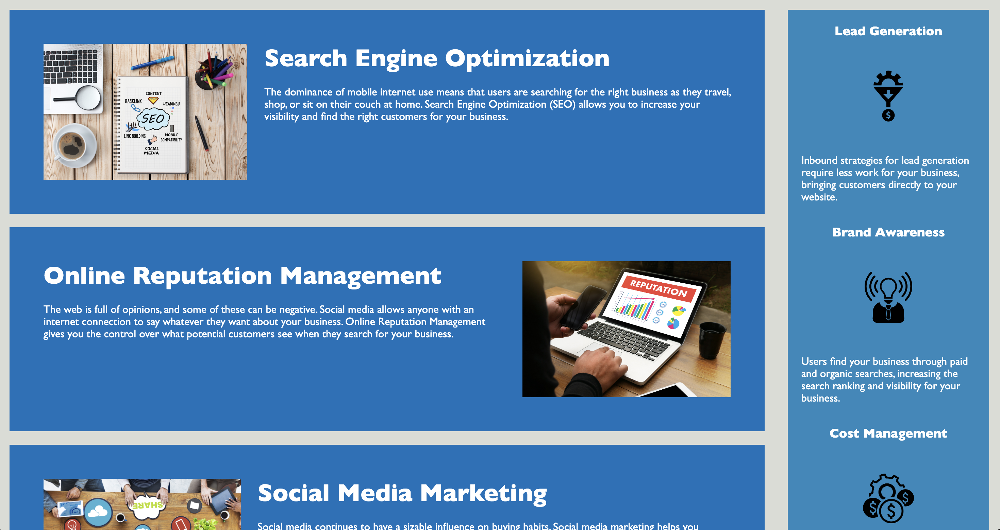

# Horiseon Website

## Description

In this project we refactored code that was given to us.  We went through the HTML and replace all the "div's" possible with the correct semantic tags.  We then had went through and refactored the CSS file included.  We consolidated the css and made sure it was using proper structure and naming.

## Repository

Link to deployed code:  https://jarrodkrauszer.github.io/horiseon_website/

## Technologies

 - This is written with HTML5 and CSS 
 - HTML follows semantic structure for SEO
 - Refactor CSS for faster loading and efficiency
 - All img tags have alt descriptions for accessibility

## Mock-Up

The following image shows the web application's appearance and functionality:

